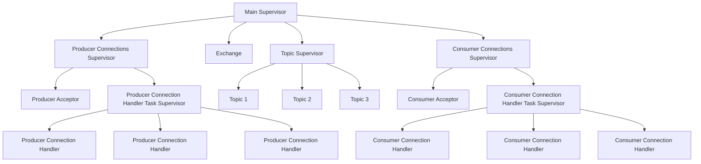

```mermaid
flowchart TD
    A[Main Supervisor] --> B[Producer Connections Supervisor]
    B --> B1[Producer Acceptor]
    B --> B2[Producer Connection Handler Task Supervisor]
    B2 --> B21[Producer Connection Handler]
    B2 --> B22[Producer Connection Handler]
    B2 --> B23[Producer Connection Handler]

    A --> E[Exchange]
    A --> T[Topic Supervisor]
    T --> T1[Topic 1]
    T --> T2[Topic 2]
    T --> T3[Topic 3]

    A[Main Supervisor] --> C[Consumer Connections Supervisor]
    C --> C1[Consumer Acceptor]
    C --> C2[Consumer Connection Handler Task Supervisor]
    C2 --> C21[Consumer Connection Handler]
    C2 --> C22[Consumer Connection Handler]
    C2 --> C23[Consumer Connection Handler]
```
